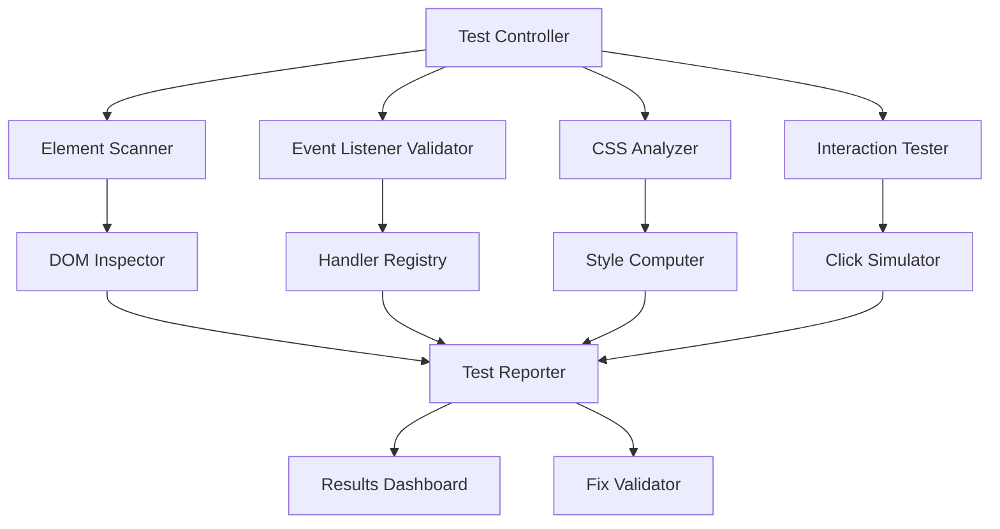

# Design Document

## Overview

The Portfolio Clickability Testing & Validation system is a comprehensive testing framework designed to diagnose, validate, and monitor user interactions on the portfolio page. The system provides automated testing capabilities, real-time monitoring, and detailed reporting to ensure all interactive elements function correctly across different browsers and conditions.

## Architecture

The system follows a modular architecture with three main layers:

1. **Test Engine Layer**: Core testing logic and validation algorithms
2. **Interaction Monitor Layer**: Real-time event tracking and state monitoring  
3. **Reporting Layer**: Test results, analytics, and fix validation reports

### Component Interaction Flow



## Components and Interfaces

### 1. Test Controller

**Purpose**: Orchestrates all testing operations and manages test execution flow.

**Interface**:
```typescript
interface TestController {
  runFullDiagnostic(): Promise<TestResults>
  validateFix(fixType: FixType): Promise<ValidationResults>
  startRealTimeMonitoring(): void
  stopRealTimeMonitoring(): void
  generateReport(): TestReport
}
```

**Key Methods**:
- `runFullDiagnostic()`: Executes complete interaction testing suite
- `validateFix()`: Tests specific fixes and compares before/after results
- `startRealTimeMonitoring()`: Begins continuous interaction monitoring
- `generateReport()`: Creates comprehensive test results report

### 2. Element Scanner

**Purpose**: Discovers and catalogs all interactive elements on the portfolio page.

**Interface**:
```typescript
interface ElementScanner {
  scanProjectToggleButtons(): InteractiveElement[]
  scanAccordionElements(): InteractiveElement[]
  scanNavigationLinks(): InteractiveElement[]
  validateElementProperties(element: Element): ElementValidation
}
```

**Scanning Strategy**:
- Query selectors for known interactive element classes
- Validate element visibility and accessibility
- Check element dimensions and positioning
- Verify element is within viewport bounds

### 3. Event Listener Validator

**Purpose**: Verifies that proper event handlers are attached to interactive elements.

**Interface**:
```typescript
interface EventListenerValidator {
  checkClickHandlers(elements: Element[]): HandlerValidation[]
  validateEventPropagation(element: Element): PropagationTest
  testHandlerExecution(element: Element): ExecutionTest
  getEventListenerCount(element: Element): number
}
```

**Validation Process**:
- Inspect element event listeners using `getEventListeners()`
- Test handler execution by triggering synthetic events
- Validate event propagation and bubbling behavior
- Check for duplicate or conflicting handlers

### 4. CSS Analyzer

**Purpose**: Identifies CSS rules that may block or interfere with user interactions.

**Interface**:
```typescript
interface CSSAnalyzer {
  checkPointerEvents(element: Element): PointerEventStatus
  validateVisibility(element: Element): VisibilityStatus
  detectZIndexIssues(element: Element): ZIndexAnalysis
  analyzeCSSBlocking(): BlockingRuleReport[]
}
```

**Analysis Methods**:
- Compute final CSS values for interaction-related properties
- Detect `pointer-events: none` and similar blocking rules
- Check for visibility and display property issues
- Analyze z-index stacking and element overlap

### 5. Interaction Tester

**Purpose**: Simulates user interactions and validates responses.

**Interface**:
```typescript
interface InteractionTester {
  simulateClick(element: Element): ClickTestResult
  testKeyboardNavigation(): KeyboardTestResult
  validateTouchInteractions(): TouchTestResult
  measureResponseTime(element: Element): PerformanceMetrics
}
```

**Testing Approach**:
- Programmatic click simulation using `element.click()`
- Coordinate-based clicking using `MouseEvent`
- Keyboard event simulation for accessibility testing
- Performance timing measurement for responsiveness

### 6. Real-Time Monitor

**Purpose**: Continuously monitors interactions during normal page usage.

**Interface**:
```typescript
interface RealTimeMonitor {
  startMonitoring(): void
  stopMonitoring(): void
  logInteraction(event: InteractionEvent): void
  getInteractionHistory(): InteractionLog[]
}
```

**Monitoring Features**:
- Global event listener for all click events
- State change tracking for portfolio components
- Error detection and logging
- Performance metrics collection

## Data Models

### InteractiveElement
```typescript
interface InteractiveElement {
  element: HTMLElement
  type: 'project-toggle' | 'accordion-header' | 'accordion-link' | 'navigation'
  selector: string
  expectedBehavior: string
  isVisible: boolean
  hasEventListeners: boolean
  cssIssues: string[]
}
```

### TestResults
```typescript
interface TestResults {
  timestamp: Date
  totalElements: number
  passedTests: number
  failedTests: number
  elementResults: ElementTestResult[]
  performanceMetrics: PerformanceData
  recommendations: string[]
}
```

### ClickTestResult
```typescript
interface ClickTestResult {
  element: HTMLElement
  clickRegistered: boolean
  expectedOutcome: string
  actualOutcome: string
  responseTime: number
  errors: string[]
  success: boolean
}
```

## Correctness Properties

*A property is a characteristic or behavior that should hold true across all valid executions of a system-essentially, a formal statement about what the system should do. Properties serve as the bridge between human-readable specifications and machine-verifiable correctness guarantees.*

<function_calls>
<invoke name="prework">
<parameter name="featureName">portfolio-clickability-fix

### Property Reflection

After analyzing all acceptance criteria, I identified several areas where properties can be consolidated:

**Consolidation Opportunities:**
- Properties 1.1-1.5 (click detection) can be combined into a comprehensive click detection property
- Properties 2.1-2.5 (event listener validation) can be unified into a single event listener property
- Properties 3.1-3.5 (CSS blocking detection) can be merged into one CSS analysis property
- Properties 6.1-6.5 (real-time monitoring) can be combined into a monitoring property
- Properties 7.1-7.5 (fix validation) can be unified into a fix validation property
- Properties 8.1, 8.2, 8.4, 8.5 (performance testing) can be combined into a performance property

**Final Property Set:**

Property 1: Click Detection and Validation
*For any* interactive element on the portfolio page, when a test simulates a click, the test system should detect whether the click event was registered and report the success or failure with specific element identification

**Validates: Requirements 1.1, 1.2, 1.3, 1.4, 1.5**

Property 2: Event Listener Validation
*For any* interactive element on the portfolio page, the test system should verify that proper event listeners are attached and report any missing handlers, including after DOM updates

**Validates: Requirements 2.1, 2.2, 2.3, 2.4, 2.5**

Property 3: CSS Interaction Blocking Detection
*For any* interactive element on the portfolio page, the test system should detect CSS rules that prevent interactions (pointer-events, visibility, z-index, dimensions) and report the specific blocking mechanisms

**Validates: Requirements 3.1, 3.2, 3.3, 3.4, 3.5**

Property 4: Entrance Animation Monitoring
*For any* entrance animation state, the test system should correctly monitor animation completion and test element clickability before and after animation

**Validates: Requirements 4.2, 4.3**

Property 5: Browser Compatibility Reporting
*For any* browser-specific interaction issue detected during testing, the test system should correctly identify and report the compatibility problem

**Validates: Requirements 5.4**

Property 6: Real-Time Interaction Monitoring
*For any* user interaction that occurs during monitoring, the test system should log the event with timestamps, track state changes, record errors, and provide visual feedback

**Validates: Requirements 6.1, 6.2, 6.3, 6.4, 6.5**

Property 7: Fix Validation
*For any* fix applied to resolve interaction issues, the test system should re-test affected interactions, compare success rates, generate improvement reports, and detect any new problems introduced

**Validates: Requirements 7.1, 7.2, 7.3, 7.4, 7.5**

Property 8: Performance Validation
*For any* interactive element tested, the test system should measure response times, validate timing requirements, identify bottlenecks, and ensure testing doesn't impact normal performance

**Validates: Requirements 8.1, 8.2, 8.4, 8.5**

## Error Handling

### Error Categories

1. **Element Not Found Errors**
   - Handle missing interactive elements gracefully
   - Provide clear error messages with element selectors
   - Continue testing other elements when one is missing

2. **Event Listener Errors**
   - Catch and report event handler execution failures
   - Handle cases where event listeners are not properly attached
   - Provide fallback testing methods when direct handler testing fails

3. **CSS Analysis Errors**
   - Handle cases where computed styles cannot be determined
   - Gracefully handle cross-origin CSS restrictions
   - Provide alternative analysis methods for complex CSS scenarios

4. **Browser Compatibility Errors**
   - Handle API differences between browsers
   - Provide fallback methods for unsupported browser features
   - Clear error reporting for browser-specific limitations

5. **Performance Testing Errors**
   - Handle timing measurement failures
   - Provide alternative performance metrics when high-resolution timing is unavailable
   - Graceful degradation for performance testing in constrained environments

### Error Recovery Strategies

- **Retry Logic**: Implement exponential backoff for transient failures
- **Fallback Methods**: Provide alternative testing approaches when primary methods fail
- **Partial Results**: Return partial test results when some tests fail
- **Error Aggregation**: Collect and report multiple errors in a single test run

## Testing Strategy

### Unit Testing Approach

**Test Categories:**
- **Element Scanner Tests**: Verify correct identification of interactive elements
- **Event Validator Tests**: Test event listener detection and validation logic
- **CSS Analyzer Tests**: Validate CSS rule analysis and blocking detection
- **Interaction Simulator Tests**: Test click simulation and response validation
- **Reporter Tests**: Verify test result formatting and report generation

**Key Unit Test Examples:**
- Test element scanner with various DOM structures
- Validate event listener detection with different handler types
- Test CSS analyzer with various blocking scenarios
- Verify interaction simulator with different element states

### Property-Based Testing Configuration

**Testing Framework**: Use fast-check for JavaScript property-based testing
**Test Configuration**: Minimum 100 iterations per property test
**Test Environment**: Run in both headless and real browser environments

**Property Test Implementation Strategy:**
- Generate random DOM structures for element scanning tests
- Create various CSS rule combinations for blocking detection tests
- Simulate different interaction patterns for validation tests
- Test with different browser environments and viewport sizes

**Test Data Generation:**
- Random interactive element configurations
- Various CSS property combinations that may block interactions
- Different entrance animation states and timing scenarios
- Multiple browser user agent strings and capabilities

### Integration Testing

**End-to-End Test Scenarios:**
1. **Full Portfolio Test**: Complete interaction testing on actual portfolio page
2. **Fix Validation Test**: Apply known fixes and validate improvements
3. **Cross-Browser Test**: Run tests across multiple browser environments
4. **Performance Test**: Validate testing system performance impact

**Test Environment Setup:**
- Automated browser testing with Playwright or Selenium
- Multiple browser versions and configurations
- Mobile and desktop viewport testing
- Network throttling for performance testing

### Continuous Validation

**Automated Testing Pipeline:**
- Run interaction tests on every portfolio page change
- Validate fixes automatically in CI/CD pipeline
- Monitor interaction success rates in production
- Alert on interaction failure rate increases

**Monitoring and Alerting:**
- Real-time interaction success rate monitoring
- Automated alerts for interaction failures above threshold
- Performance regression detection
- Browser compatibility issue notifications