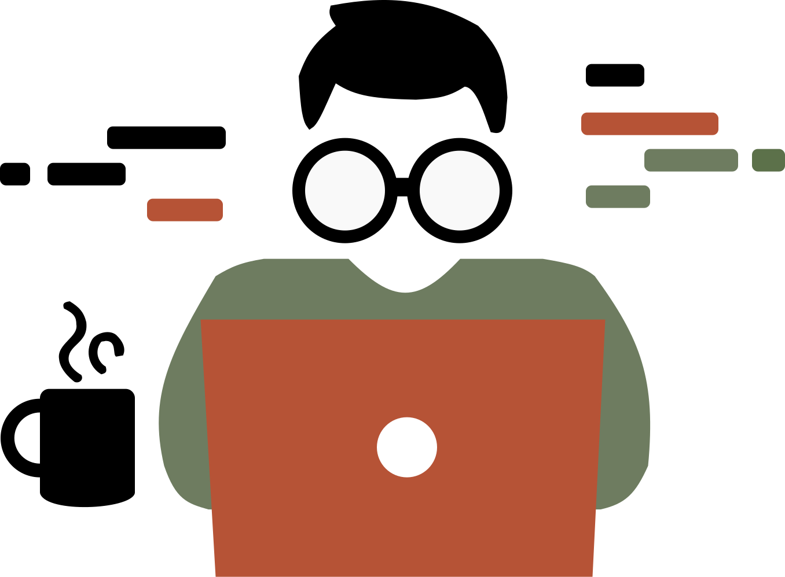

# Leon Madara Portfolio - Project Documentation

> **Status**: 🚧 In Active Development  
> **Version**: 1.0.0  
> **Tech Stack**: Vanilla HTML5, CSS3, JavaScript (ES6+)  
> **Last Updated**: October 24, 2025

---

## 📋 Table of Contents

1. [Project Overview](#project-overview)
2. [Design System](#design-system)
3. [Component Documentation](#component-documentation)
4. [Technical Architecture](#technical-architecture)
5. [File Structure](#file-structure)
6. [Feature Implementation Status](#feature-implementation-status)
7. [Responsive Design Requirements](#responsive-design-requirements)
8. [Testing Infrastructure](#testing-infrastructure)
9. [Development Guidelines](#development-guidelines)
10. [Feature Change Request Template](#feature-change-request-template)

---

## 📖 Project Overview

### Purpose
A modern, accessible, and performant portfolio landing page for Leon Madara, a Full Stack AI Developer from Nairobi, Kenya.

### Core Objectives
- ✅ Showcase professional identity with Kenyan cultural elements
- ✅ Demonstrate advanced web development skills
- ✅ Ensure WCAG 2.1 AA accessibility compliance
- ✅ Provide smooth, engaging animations and interactions
- ✅ Support all modern browsers and devices

### Technology Constraints
- **No frameworks** - Pure vanilla JavaScript
- **No build tools required** - Direct browser execution
- **Progressive enhancement** - Works without JavaScript
- **Performance first** - Optimized for low-end devices

---

## 🎨 Design System

### Color Palette

#### Primary Colors (Kenyan Flag)
```css
--kenyan-black: #000000    /* Primary text, gradient start */
--kenyan-red: #ce1126      /* Gradient middle, active states */
--kenyan-green: #006b3f    /* Brand color, accents */
--kenyan-white: #ffffff    /* Backgrounds, contrast */
```

#### Accent Colors
```css
--accent-green-light: #10CF74     /* Hover states, highlights */
--primary-text: #333333           /* Body text */
--secondary-text: rgba(51, 51, 51, 0.7)  /* Muted text */
--background-light: hsl(48, 10%, 90%)    /* Page background */
```

#### Gradient Application
```css
/* Kenyan Flag Gradient: Used on role text */
background: linear-gradient(45deg, #000000 0%, #CE1126 50%, #006B3F 100%);
-webkit-background-clip: text;
-webkit-text-fill-color: transparent;
```

### Typography

#### Font Families
- **Greeting ("Hi, I'm")**: Space Mono (monospace)
  - Fallback: "Courier New", Monaco, monospace
  - Weight: 400
  
- **Name ("Leon Madara")**: Asimovian (custom sans-serif)
  - Fallback: Arial, "Helvetica Neue", sans-serif
  - Weight: 400
  
- **Role ("Full Stack AI Developer")**: Enriqueta (serif)
  - Fallback: Georgia, "Times New Roman", serif
  - Weight: 400
  
- **Body Text**: System fonts
  - Fallback: -apple-system, BlinkMacSystemFont, 'Segoe UI', Roboto, sans-serif

#### Font Size Scale

**Hero Section Typography (Current Implementation):**
```css
/* Greeting - 2x Scaled (Increased) */
--font-size-greeting-2x: clamp(5rem, 12vw, 6rem)

/* Name - 40% Reduced */
--font-size-name-reduced: clamp(3.6rem, 9.6vw, 7.2rem)

/* Role - 30% Reduced */
--font-size-role-reduced: clamp(2.1rem, 5.6vw, 3.5rem)
```

**Responsive Breakpoints:**
- **Mobile Small** (≤320px): Minimum sizes
- **Mobile** (321px - 767px): Scaled viewport units
- **Tablet** (768px - 1023px): Mid-range sizes
- **Desktop** (1024px - 1919px): Standard sizes
- **Ultra-wide** (≥1920px): Maximum sizes

### Spacing System
```css
--space-sm: clamp(0.5rem, 1.5vw, 1rem)      /* Small gaps */
--space-md: clamp(1rem, 2.5vw, 1.5rem)      /* Medium gaps */
--space-lg: clamp(1.5rem, 3.5vw, 2.5rem)    /* Large gaps */
--section-padding: clamp(3rem, 6vw, 5rem)   /* Section padding */
--content-padding: clamp(1.5rem, 4vw, 3rem) /* Content padding */
--grid-gap: clamp(2rem, 4vw, 3rem)          /* Grid gaps */
```

### Animation Timings
```css
--transition-fast: 0.15s ease-in-out         /* Quick interactions */
--transition-smooth: 0.3s cubic-bezier(0.4, 0, 0.2, 1)  /* Standard */
--transition-bounce: 0.4s cubic-bezier(0.68, -0.55, 0.265, 1.55)  /* Playful */

--animation-duration-fast: 0.3s
--animation-duration-normal: 0.6s
--animation-duration-slow: 0.8s
```

---

## 🧩 Component Documentation

### 1. Floating Navigation Header

**Location**: Top of page, fixed position  
**File**: `index.html` (lines 60-103), `css/styles.css` (header section), `js/main.js` (FloatingNavigation class)

#### Specifications
- **Height**: 60px (fixed across all devices) ✅
- **Width**: Responsive (60vw - 80vw)
- **Background**: Blurred black overlay
- **Z-index**: 100

#### Components

##### Logo Section
- **Position**: 20vw from left edge
- **Scale**: 40.5x on parent container (`.header-logo`)
- **Image Element**: `transform: none` - maintains natural 70px size
- **Visual Effects**: None - no filters, shadows, borders, padding
- **Hover Effect**: None - logo is completely static
- **Focus Effect**: None - no focus-visible styling
- **Active State**: None - no click feedback
- **Global Anchor Override**: Overrides `a:hover` and `a:focus` with `!important`
- **File**: `images/iconLEONlogo.svg`
- **No interactions**: No hover, no focus, no active, no transitions, no effects

##### Navigation Icons
- **Count**: 4 icons (Home, About, Portfolio, Contact)
- **Icon Size**: 30px × 30px SVG (fixed) ✅
- **Touch Target**: Minimum 44px × 44px for accessibility ✅
- **Position**: Absolute positioning at same vertical level as logo
- **Vertical Alignment**: `top: 15px` (matches logo positioning)
- **Horizontal Position**: `right: 0` (maintains original right positioning)
- **Container**: `.nav-icons-container` with absolute positioning
- **Z-index**: 102 (above logo's 101)

##### Icon States

**Default State:**
- Color: Default icon color
- Scale: 1.0
- No special effects

**Hover State:**
- Slight scale increase
- Visual feedback for mouse users
- **Circular Halo**: Materializes around icon
  - Animation: `haloMaterialize` (0.5s)
  - Background: Match page background color
  - Shadow: Layered box-shadows for depth

**Active State:**
- Color: `#ff0000` (red) ✅
- Scale: 1.5x ✅
- Persistent until another icon is clicked
- Prevents rapid clicking during transitions (300ms lockout)

**Elevation Animation:**
- Icon floats upward (-40px) on long hover
- Smooth cubic-bezier timing
- Halo remains in original position
- Descends back on hover exit

#### Advanced Features

**Halo Animation System:**
```javascript
HaloAnimationSystem {
  - Object pooling for performance
  - State machine: idle → materializing → active → dematerializing
  - Dynamic background color detection
  - GPU-accelerated transforms
  - Reduced motion support
}
```

**Performance Optimizations:**
- FPS monitoring (target: 60 FPS)
- Low-performance mode (activates if FPS < 45)
- Reduced complexity for slow devices
- Will-change properties for GPU acceleration

---

### 2. Hero Section

**Location**: Center of landing page  
**File**: `index.html` (lines 146-169)

#### Elements

##### Greeting Text
```html
<p class="greeting">Hi, I'm</p>
```
- **Font**: Space Mono, monospace
- **Size**: 2x scaled (increased from base)
- **Current**: `clamp(5rem, 12vw, 6rem)`
- **Color**: Inherits text color
- **Responsive**: Scales with viewport

##### Name Text
```html
<h1 class="name">Leon Madara</h1>
```
- **Font**: Asimovian, sans-serif
- **Size**: 40% reduced from original hero size
- **Current**: `clamp(3.6rem, 9.6vw, 7.2rem)`
- **Color**: Kenyan Green (`#006b3f`)
- **Hover Effect**: Subtle glow (optional)

##### Role Text with AI Pulsing Animation
```html
<h2 class="role kenyan-gradient">
    Full Stack <span class="ai-wrapper">
        <span class="ai-text">AI</span>
        
    </span> Developer
</h2>
```
- **Font**: Enriqueta, serif
- **Size**: 30% reduced from original hero size
- **Current**: `clamp(2.1rem, 5.6vw, 3.5rem)`
- **Effect**: Kenyan flag gradient (black → red → green)
- **AI Animation**: Continuous pulsing effect
  - **AI Text**: Scales from 1.0 → 0.3 → 1.0 (3s cycle)
  - **Logo Icon**: Rotates from 45° → 0° while scaling 0 → 1.5 → 0
  - **Performance**: GPU accelerated with `will-change` hints
  - **Accessibility**: Respects `prefers-reduced-motion`
  - **Mobile**: Slower animation (4s) for better performance
  - **Low-end devices**: Linear timing for smoother performance
- **Accessibility**: 
  - `aria-label="Full Stack AI Developer"`
  - `tabindex="0"` for screen reader access
  - Fallback color for unsupported browsers
  - Logo has `aria-hidden="true"` (decorative only)

##### Location Badge
```html
<div class="location-container">
  <svg class="location-pin">...</svg>
  <p class="location">From Nairobi, Kenya</p>
</div>
```
- **Icon**: Location pin SVG
- **Text**: City and country
- **Style**: Subtle, complementary

#### Decorative Elements
- **Floating Shapes**: 3 animated shapes with blur effects
- **Background Pattern**: Dotted SVG pattern (opacity: 0.4)
- **Code Elements**: 6 floating code symbols with Kenyan colors
  - `</>`, `{ }`, `[ ]`, `( )`, `=>`, `&&`
  - Positioned at various locations
  - Subtle float animation (8s duration)

---

### 3. Pill-Shaped Sidebar

**Location**: Fixed left side  
**File**: `index.html` (lines 105-143)

#### Specifications
- **Position**: Fixed left edge, vertically centered
- **Transform**: `translateY(-50%) translateX(20px) scale(1.2)`
- **Border Radius**: Full pill shape
- **Background**: Semi-transparent with backdrop blur

#### Components

##### Profile Photo
- **Size**: Responsive
- **File**: `images/profile-photo.svg`
- **Alt Text**: "Leon Madara Profile Photo"
- **Shape**: Circular within pill container

##### Social Icons
- **Count**: 3 (GitHub, LinkedIn, Contact)
- **Size**: Consistent icon sizing
- **Hover**: Scale and color change
- **Links**: 
  - GitHub: `#` (to be updated)
  - LinkedIn: `#` (to be updated)
  - Contact: `#contact` (internal link)

---

### 4. Footer

**Location**: Bottom of page  
**File**: `index.html` (lines 173-177)

#### Content
```html
<p class="footer-text">&copy; 2024 Leon Madara. All rights reserved.</p>
```
- **Style**: Simple, unobtrusive
- **Color**: Muted text color
- **Alignment**: Center

---

## 🏗️ Technical Architecture

### JavaScript Architecture

#### Main Application Object
```javascript
LeonPortfolio {
  state: {
    isInitialized: boolean
    activeNavItem: string | null
    animationsEnabled: boolean
    isMobile: boolean
    isTransitioning: boolean
    deviceCapabilities: object
  },
  
  config: {
    animationDuration: 300ms
    staggerDelay: 100ms
    haloAnimationDuration: 200ms
    breakpoints: { mobile: 768, tablet: 1024 }
  }
}
```

#### Core Systems

**1. HaloAnimationSystem**
- Purpose: Manage circular halo animations around icons
- Features:
  - Object pooling for performance
  - State machine for animation lifecycle
  - Dynamic background color detection
  - GPU acceleration
  - Reduced motion support

**2. FloatingNavigation**
- Purpose: Handle navigation interactions and animations
- Features:
  - Icon click handling with transition lock
  - Hover state management
  - Elevation animations
  - Performance monitoring
  - Viewport change adaptation

**3. Responsive Features Manager**
- Purpose: Ensure responsive design compliance
- Features:
  - Device capability detection (touch, hover, precision)
  - Viewport monitoring (resize, orientation, zoom)
  - Touch gesture support
  - Accessibility enforcement
  - Cross-device compatibility

**4. Performance Monitor**
- Purpose: Track and optimize performance
- Features:
  - FPS tracking
  - Memory usage monitoring
  - Load time measurement
  - Automatic optimization adjustments

### CSS Architecture

#### Organization
```
1. CSS Custom Properties (:root)
2. Custom Font Family Classes
3. Kenyan Gradient Class
4. CSS Reset
5. Performance Optimization Classes
6. Keyframe Animations
7. Background Patterns
8. Component Styles
9. Responsive Media Queries
10. Accessibility Styles
```

#### Key CSS Features

**GPU Acceleration:**
```css
.gpu-accelerated {
  will-change: transform, opacity;
  transform: translate3d(0, 0, 0);
  backface-visibility: hidden;
  transform-style: preserve-3d;
}
```

**Reduced Motion Support:**
```css
@media (prefers-reduced-motion: reduce) {
  *, *::before, *::after {
    animation-duration: 0.01ms !important;
    transition-duration: 0.01ms !important;
  }
}
```

**High Contrast Mode:**
```css
@media (prefers-contrast: high) {
  .kenyan-gradient {
    color: #000000 !important;
    background: none !important;
    text-shadow: 1px 1px 2px rgba(255, 255, 255, 0.8) !important;
  }
}
```

---

## 📁 File Structure

```
leonsPortfolio/
├── index.html                 # Main landing page (195 lines)
├── package.json               # Dev dependencies & scripts
├── 
├── css/
│   └── styles.css            # Complete stylesheet (~5,327 lines)
│
├── js/
│   └── main.js               # All JavaScript logic (~3,632 lines)
│
├── images/                   # SVG graphics and logos
│   ├── dot-pattern.svg       # Background dot pattern
│   ├── hanginLFT.svg         # Decorative element
│   ├── iconLEONlogo.svg      # Main logo (header)
│   ├── Left-flag.svg         # Decorative flag
│   ├── leonLogo.svg          # Full logo
│   ├── logoICON.svg          # Logo icon variant
│   └── profile-photo.svg     # Profile picture
│
├── public/                   # Deployment assets (mirrors root structure)
│   ├── css/
│   │   └── styles.css
│   └── images/
│       ├── dot-pattern.svg
│       ├── hanginLFT.svg
│       ├── Left-flag.svg
│       ├── leonLogo.svg
│       ├── profile-photo.jpg
│       └── profile-photo.svg
│
├── test-header.html          # Header layout testing
├── test-navigation.html      # Navigation icon state testing
├── test-responsive.html      # Responsive requirements testing
│
├── validation/               # Test suites
│   ├── accessibility-test.html
│   ├── accessibility-test.js          # WCAG 2.1 AA compliance tests
│   ├── cross-browser-test.html        # Browser compatibility UI
│   ├── cross-browser-test.js          # Browser compatibility tests
│   ├── performance-test.js            # Performance metrics tests
│   ├── role-gradient-test.html        # Gradient effect testing
│   ├── greeting-responsive-test.html  # Typography scaling tests
│   └── typography-responsive-test.html # Full typography validation
│
└── PROJECT.md                # This documentation file
```

---

## ✅ Feature Implementation Status

### Core Features

| Feature | Status | Notes |
|---------|--------|-------|
| Hero Section Typography | ✅ Complete | Greeting 2x, Name -40%, Role -30% |
| Kenyan Flag Gradient | ✅ Complete | Applied to role text with fallbacks |
| Floating Navigation | ✅ Complete | 60px height, 30px icons |
| Navigation Icons | ✅ Complete | 4 icons with hover/active states |
| Active State Styling | ✅ Complete | Red color, 1.5x scale |
| Circular Halo Animation | ✅ Complete | Materialize/dematerialize with object pooling |
| Elevation Animation | ✅ Complete | Icon floats up on long hover |
| Logo Positioning | ✅ Complete | 20vw from left, 40.5x scale (static, no hover) |
| Pill Sidebar | ✅ Complete | Profile photo + social icons |
| Background Patterns | ✅ Complete | Dots + floating code elements |
| Decorative Shapes | ✅ Complete | 3 floating blur shapes |

### Responsive Design (Requirements 8.1-8.5)

| Requirement | Status | Implementation |
|-------------|--------|----------------|
| 8.1: 60px Header Height | ✅ Complete | Fixed height across all devices |
| 8.2: 30px Icon Size | ✅ Complete | Maintained on mobile, tablet, desktop |
| 8.3: Adaptive Layout | ✅ Complete | Container adapts to viewport widths |
| 8.4: Touch-Friendly | ✅ Complete | Hover + click work on all devices |
| 8.5: 44px Touch Targets | ✅ Complete | Minimum size enforced for accessibility |

### Accessibility Features

| Feature | Status | Implementation |
|---------|--------|----------------|
| WCAG 2.1 AA Compliance | ✅ Complete | Validated with test suite |
| Semantic HTML | ✅ Complete | Proper landmarks and headings |
| ARIA Labels | ✅ Complete | All interactive elements labeled |
| Keyboard Navigation | ✅ Complete | Full keyboard support |
| Screen Reader Support | ✅ Complete | Live regions and announcements |
| Skip Navigation | ✅ Complete | Skip to main content link |
| Focus Management | ✅ Complete | Visible focus indicators |
| Reduced Motion | ✅ Complete | Respects prefers-reduced-motion |
| High Contrast Mode | ✅ Complete | Proper contrast in all modes |
| Color Contrast | ✅ Complete | Sufficient contrast ratios |

### Performance Optimizations

| Feature | Status | Implementation |
|---------|--------|----------------|
| GPU Acceleration | ✅ Complete | Transform3d and will-change |
| Object Pooling | ✅ Complete | Halo elements reused |
| FPS Monitoring | ✅ Complete | Automatic performance adjustments |
| Lazy Loading | ⏳ Pending | For future sections |
| Code Splitting | ⏳ Pending | When multiple pages added |
| Image Optimization | ⏳ Pending | SVGs optimized, raster images TBD |
| Service Worker | ⏳ Pending | For offline support |

### Cross-Browser Compatibility

| Browser | Status | Notes |
|---------|--------|-------|
| Chrome (latest) | ✅ Complete | Full support |
| Firefox (latest) | ✅ Complete | Full support |
| Safari (latest) | ✅ Complete | Full support with webkit prefixes |
| Edge (latest) | ✅ Complete | Full support |
| Internet Explorer 11 | ✅ Degraded | Fallbacks provided, limited animations |

---

## 📱 Responsive Design Requirements

### Breakpoint System

```javascript
const breakpoints = {
  mobileSmall: 320,   // <= 320px
  mobile: 480,        // 321px - 480px
  mobileLarge: 767,   // 481px - 767px
  tablet: 1023,       // 768px - 1023px
  desktop: 1919,      // 1024px - 1919px
  ultraWide: 1920     // >= 1920px
}
```

### Device-Specific Adaptations

#### Mobile (≤767px)
- **Navigation**: Full-width container, reduced gaps
- **Typography**: Minimum clamp sizes
- **Touch Targets**: 44px minimum enforced
- **Sidebar**: Hidden or collapsed
- **Animations**: Reduced complexity
- **Performance**: Low-end device optimizations

#### Tablet (768px - 1023px)
- **Navigation**: Balanced spacing
- **Typography**: Mid-range sizes
- **Touch Targets**: 44px minimum maintained
- **Sidebar**: Conditionally visible
- **Animations**: Full features
- **Performance**: Standard optimizations

#### Desktop (1024px+)
- **Navigation**: Optimal spacing
- **Typography**: Maximum sizes
- **Hover States**: Full hover effects
- **Sidebar**: Fully visible
- **Animations**: All effects enabled
- **Performance**: Enhanced visual effects

### Orientation Handling

**Portrait Mode:**
- Vertical stacking priority
- Increased spacing between elements
- Full-width components

**Landscape Mode:**
- Horizontal layout optimizations
- Reduced vertical spacing
- Adjusted icon gaps for small heights (<500px)

### Touch vs. Mouse Detection

```javascript
deviceCapabilities: {
  hasTouch: boolean,        // Touch screen available
  hasHover: boolean,        // Hover interactions supported
  hasFinePrecision: boolean,// Fine pointer (mouse)
  isHybrid: boolean,        // Both touch and mouse
  isTouchOnly: boolean,     // Touch without hover
  isMouseOnly: boolean      // Mouse without touch
}
```

---

## 🧪 Testing Infrastructure

### Test Files

#### 1. Header Test (`test-header.html`)
- Tests header dimensions (60px height)
- Logo positioning (15vw from left)
- Logo scale (6.75x on hover)
- Navigation container width

#### 2. Navigation Test (`test-navigation.html`)
- Icon active state transitions
- Click handling with rapid-click prevention
- Color changes (red on active)
- Scale changes (1.5x on active)
- State persistence

#### 3. Responsive Test (`test-responsive.html`)
- Requirement 8.1: 60px header across devices
- Requirement 8.2: 30px icon size maintenance
- Requirement 8.3: Adaptive container layout
- Requirement 8.4: Touch-friendly interactions
- Requirement 8.5: 44px touch target minimum

#### 4. Accessibility Test (`validation/accessibility-test.js`)
**Test Categories:**
- Semantic markup validation
- ARIA labels and attributes
- Keyboard navigation
- Focus management
- Color contrast
- Screen reader support
- WCAG 2.1 AA compliance

**Output:**
- Overall score (%)
- WCAG compliance level (AA, A, or Non-compliant)
- Error count and detailed error list
- Warning count with recommendations

#### 5. Cross-Browser Test (`validation/cross-browser-test.html`)
**Tests:**
- Browser detection and version
- Feature support (CSS Grid, Flexbox, Transforms, etc.)
- Animation compatibility
- Interaction capabilities
- Performance metrics
- Device type detection

#### 6. Performance Test (`validation/performance-test.js`)
**Metrics:**
- Page load time
- DOM ready time
- Animation frame rate (FPS)
- Memory usage
- Rendering performance
- Resource optimization

#### 7. Typography Tests
- **Greeting Responsive Test**: 2x scaling validation
- **Typography Responsive Test**: Cross-device font rendering
- **Role Gradient Test**: Kenyan flag gradient rendering

### Running Tests

```bash
# Start development server
npm run dev

# Access test pages
http://localhost:3000/test-header.html
http://localhost:3000/test-navigation.html
http://localhost:3000/test-responsive.html
http://localhost:3000/validation/accessibility-test.html
http://localhost:3000/validation/cross-browser-test.html
# ... etc
```

### Test Coverage Goals

- ✅ Visual Regression: Manual verification
- ✅ Accessibility: Automated WCAG validation
- ✅ Cross-Browser: Automated compatibility checks
- ✅ Performance: Automated metrics tracking
- ✅ Responsive: Automated layout validation
- ⏳ Unit Tests: To be implemented for utility functions
- ⏳ E2E Tests: To be implemented for user flows

---

## 🛠️ Development Guidelines

### Code Style

#### HTML
- Semantic HTML5 elements
- ARIA attributes for accessibility
- Meaningful alt text for images
- Proper heading hierarchy (single h1, logical flow)
- Self-closing tags for void elements

#### CSS
- Mobile-first approach
- BEM-inspired naming (not strict BEM)
- CSS custom properties for theming
- Avoid !important (except for accessibility overrides)
- Group related properties (positioning, box model, typography, visual)
- Comment complex selectors and animations

#### JavaScript
- ES6+ syntax
- Object-oriented with namespace pattern
- Pure functions where possible
- Clear, descriptive variable names
- Comments for complex logic
- Error handling for all async operations

### Performance Considerations

**Critical:**
- Use `translate3d()` for animations (GPU acceleration)
- Add `will-change` for frequently animated properties
- Remove `will-change` after animation completes
- Debounce/throttle event handlers (resize, scroll)
- Use `requestAnimationFrame` for animations
- Implement object pooling for repeated DOM operations

**Important:**
- Minimize DOM queries (cache selectors)
- Batch DOM reads and writes
- Use event delegation for repeated elements
- Lazy load images and non-critical resources
- Compress and optimize assets

### Accessibility Checklist

**Before Committing:**
- ✅ All interactive elements have accessible names
- ✅ Focus indicators are visible
- ✅ Keyboard navigation works for all features
- ✅ Color contrast meets WCAG AA (4.5:1 for text)
- ✅ Reduced motion preferences respected
- ✅ Screen reader testing completed
- ✅ Semantic HTML structure maintained
- ✅ ARIA attributes used correctly (not overused)

### Browser Testing Checklist

**Test in:**
- Chrome (latest)
- Firefox (latest)
- Safari (latest) - especially for webkit-specific issues
- Edge (latest)
- Mobile Safari (iOS)
- Chrome Mobile (Android)

**Verify:**
- Layout responsiveness
- Animation smoothness
- Touch interactions
- Keyboard navigation
- Hover states (desktop)
- Active states (mobile)

### Git Workflow

**Branch Naming:**
- `feature/feature-name` - New features
- `fix/bug-description` - Bug fixes
- `refactor/component-name` - Code improvements
- `test/test-description` - Test additions
- `docs/documentation-update` - Documentation changes

**Commit Messages:**
- Use present tense ("Add feature" not "Added feature")
- Be descriptive but concise
- Reference issues/tasks when applicable
- Examples:
  - `feat: Add circular halo animation to navigation icons`
  - `fix: Correct icon sizing on tablet devices`
  - `refactor: Optimize halo object pooling system`
  - `test: Add responsive layout validation tests`
  - `docs: Update typography guidelines in PROJECT.md`

---

## 📋 Feature Change Request Template

When requesting a feature change, please provide the following information:

### Template

```markdown
## Feature Change Request

### Type
- [ ] New Feature
- [ ] Modification to Existing Feature
- [ ] Bug Fix
- [ ] Performance Optimization
- [ ] Accessibility Improvement
- [ ] Responsive Design Adjustment

### Component/Section Affected
[e.g., Navigation Header, Hero Section, Typography, etc.]

### Current Behavior
[Describe what currently exists]

### Desired Behavior
[Describe what you want to change or add]

### Design Specifications
[Provide specific measurements, colors, animations, etc.]

**Colors:**
- Primary:
- Secondary:
- States (hover, active, focus):

**Dimensions:**
- Width:
- Height:
- Spacing:

**Typography:**
- Font family:
- Font size:
- Font weight:
- Line height:

**Animations:**
- Duration:
- Timing function:
- Trigger:

### Responsive Behavior
[Describe how it should behave on different devices]

- Mobile (≤767px):
- Tablet (768px - 1023px):
- Desktop (≥1024px):

### Accessibility Requirements
- Keyboard navigation:
- Screen reader support:
- Focus management:
- Color contrast:

### Priority
- [ ] Critical (Blocks launch)
- [ ] High (Important for UX)
- [ ] Medium (Nice to have)
- [ ] Low (Future enhancement)

### Additional Context
[Screenshots, mockups, references, or any other helpful information]
```

### Example Usage

```markdown
## Feature Change Request

### Type
- [x] Modification to Existing Feature

### Component/Section Affected
Navigation Icons

### Current Behavior
Navigation icons turn red (#ff0000) and scale to 1.5x when active.

### Desired Behavior
Change active state to use Kenyan green color (#006b3f) instead of red, 
and increase scale to 1.8x for better visibility.

### Design Specifications

**Colors:**
- Active state: #006b3f (Kenyan green)

**Dimensions:**
- Active scale: 1.8x (increased from 1.5x)

**Animations:**
- Duration: 0.3s (keep current)
- Timing function: ease-in-out (keep current)

### Responsive Behavior
Same behavior across all devices (mobile, tablet, desktop)

### Accessibility Requirements
- Maintain 44px minimum touch target size
- Ensure sufficient color contrast with background
- Preserve screen reader announcements

### Priority
- [x] Medium (Nice to have)

### Additional Context
Green color better aligns with overall Kenyan theme and personal brand.
```

---

## 🚀 Deployment Checklist

### Pre-Deployment

- [ ] All tests passing
- [ ] Accessibility validation complete
- [ ] Cross-browser testing complete
- [ ] Performance metrics acceptable
- [ ] Images optimized
- [ ] Social media links updated (currently placeholder #)
- [ ] Meta tags updated (OG image URLs)
- [ ] Favicon added
- [ ] Analytics integrated (if applicable)
- [ ] Contact form functional (if adding backend)

### Deployment Steps

1. **Build Optimization**
   - Minify CSS (optional, currently not required)
   - Minify JavaScript (optional, currently not required)
   - Optimize images
   - Generate sitemap

2. **Deploy to Hosting**
   - Upload files to hosting provider
   - Configure domain (if applicable)
   - Set up SSL certificate
   - Test live site

3. **Post-Deployment**
   - Verify all links work
   - Test on multiple devices
   - Check analytics integration
   - Monitor performance metrics

---

## 📊 Future Enhancements

### Planned Features

#### Phase 1 (Short-term)
- [ ] About section with detailed bio
- [ ] Portfolio/Projects showcase grid
- [ ] Contact form with backend integration
- [ ] Download CV button
- [ ] Skills visualization
- [ ] Testimonials section

#### Phase 2 (Medium-term)
- [ ] Dark mode toggle
- [ ] Blog integration
- [ ] Project filtering and search
- [ ] Smooth scroll between sections
- [ ] Animated statistics/counters
- [ ] Case study deep dives

#### Phase 3 (Long-term)
- [ ] Multi-language support (Swahili/English)
- [ ] CMS integration for easy updates
- [ ] Progressive Web App (PWA)
- [ ] Offline support
- [ ] Advanced animations with GSAP or custom WebGL
- [ ] 3D elements or interactive visualizations

---

## 🤝 Contributing

### Guidelines

1. **Review PROJECT.md** before making changes
2. **Test thoroughly** across browsers and devices
3. **Maintain accessibility** standards
4. **Follow code style** guidelines
5. **Update documentation** for significant changes
6. **Use feature request template** for new features

### Questions or Issues?

Contact Leon Madara or open an issue with detailed information.

---

## 📝 Version History

| Version | Date | Changes |
|---------|------|---------|
| 1.0.0 | 2024-10-24 | Initial documentation |

---

## 📄 License

MIT License - © 2024 Leon Madara. All rights reserved.

---

**Last Updated**: October 24, 2025  
**Maintained By**: Leon Madara  
**Documentation Version**: 1.0.0

